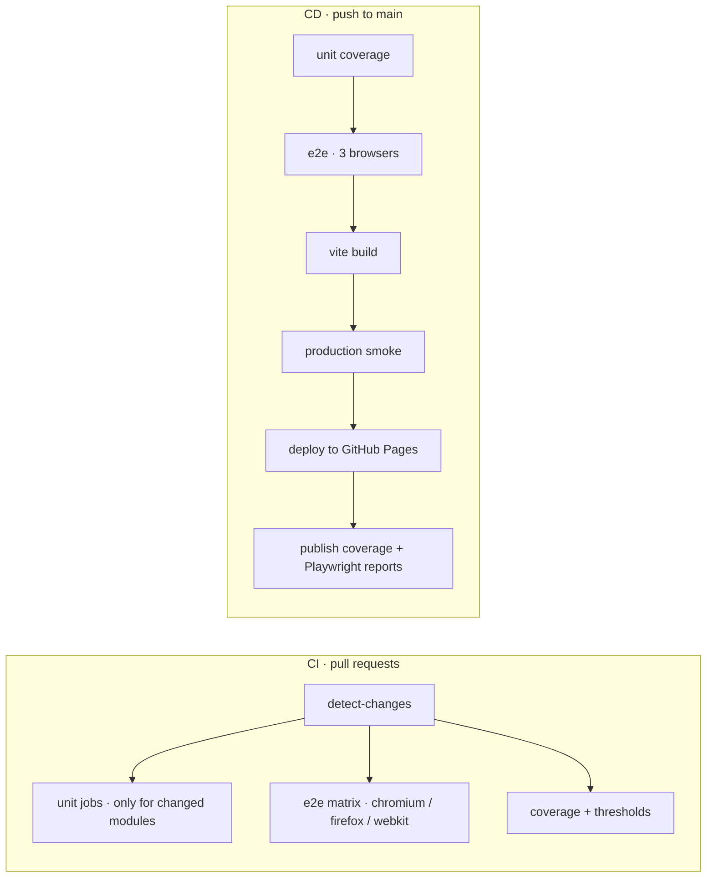

# ShopCart — a front-end test automation playground

A small, self-contained e-commerce SPA (product grid, cart, multi-step checkout) built to be a stable target for practising front-end test automation — and a reference implementation for test architecture and CI/CD design.

**Live demo:** [https://playground.trazire.com/web-playground/](https://playground.trazire.com/web-playground/)

**Test reports:** [unit coverage](https://playground.trazire.com/web-playground/coverage/) · [Playwright report](https://playground.trazire.com/web-playground/test-reports/)

## What this is

The app does three things: lists six products, manages a cart, and runs a validated checkout flow. Everything beyond that exists to make automation honest and repeatable:

- every interactive element carries a `data-testid` — no brittle CSS or text selectors needed
- business logic is pure and separated from the DOM, so it is unit-testable without a browser
- no backend, no auth, no real payments, no third-party runtime dependencies
- deterministic state and UI — safe for visual regression and CI

It is deliberately small. The point is the engineering around it, not the app.

## Who it's for

QA and SDET practitioners who want something more realistic than a todo list to practise against:

- locator and waiting strategies against a real DOM
- Page Object Model and test layering
- component-level rendering checks
- accessibility auditing with axe
- visual regression across browsers
- reading (or building) a CI/CD pipeline that actually gates a deploy

## Application design

| Piece | Choice | Why |
|-------|--------|-----|
| App | Vanilla JS ES modules | No framework noise between the test and the browser |
| Logic | `src/products.js`, `src/cart.js`, `src/checkout.js` | Pure functions — unit tests need no DOM |
| Wiring | `src/main.js` | Only place that touches the DOM and app state |
| Build | Vite 6 | Fast dev server; production bundle served from the repo's Pages sub-path |
| Styling | Tailwind CSS 4 (`@tailwindcss/vite`) | Utility classes only; no runtime CSS |
| Assets | Local SVG placeholders, local favicon, generated OG image | No CDN or third-party requests — CI and users see identical pages |

Additional details: a strict CSP meta policy, social/OG metadata, an add-to-cart feedback animation that respects `prefers-reduced-motion`, and the sans font stack pinned to `Arial, Helvetica, sans-serif` so Linux CI and local runs render identically.

## Test architecture

Six layers, each chosen because it catches something the others cannot:

| Layer | Tool | Scope |
|-------|------|-------|
| Unit | Vitest | Cart math, checkout validation, product helpers. Coverage thresholds: 80% statements/functions/lines, 70% branches |
| Component | Playwright (`setContent`) | Isolated UI fragments without the full app |
| E2E | Playwright + Page Object Model | Full user flows (`tests/e2e/pages`) on Chromium, Firefox and WebKit |
| Accessibility | `@axe-core/playwright` | Homepage, cart modal, shipping and payment steps — no critical or serious violations |
| Visual regression | Playwright screenshots | 5 screens × 3 browsers, baselines committed and generated on Linux |
| Production smoke | Playwright against `vite preview` | Built output sanity: base path resolves, no console errors or failed requests, images decode, add-to-cart works |

Design decisions worth noting:

- the smoke layer runs against the **built artefact**, not the dev server, so base-path and asset problems fail the pipeline before anything ships
- visual baselines are font-sensitive, so the font stack is pinned rather than left to the system — otherwise the same page is 1017px tall locally and 977px on the runner
- 43 unit tests and 126 Playwright test runs (42 per browser) — fast enough to run on every PR

## CI/CD design

**CI (pull requests).** A `detect-changes` action inspects the diff and drives job fan-out: a changed module only runs its own unit job, and the 3-browser Playwright matrix only runs when UI or E2E files change. Coverage thresholds are enforced on every PR, and per-browser Playwright reports plus coverage HTML are uploaded as artifacts. Concurrency groups cancel superseded runs.

**CD (push to `main`).** The pipeline re-runs unit coverage, the full 3-browser E2E suite, and the Vite build. Only then does the production smoke test run against the built output — the deploy step cannot execute if it fails. Coverage and Playwright reports are copied into the deployed site, so every release publishes its own test evidence at `/coverage/` and `/test-reports/`.

Workflows: [`.github/workflows/ci.yml`](.github/workflows/ci.yml) · [`.github/workflows/cd.yml`](.github/workflows/cd.yml)

## How this repo was built

The application code was built with AI assistance. The test strategy, automation architecture, and CI/CD pipeline were designed and implemented by me — that's the part this repo is meant to demonstrate.

## Author

**Rio Anggara Pratama** — Senior SDET, 10+ years in QA engineering.

- LinkedIn: [linkedin.com/in/rio-anggara](https://www.linkedin.com/in/rio-anggara/)
- GitHub: [@rio-ap](https://github.com/rio-ap)

## License

MIT — see [LICENSE](LICENSE).
