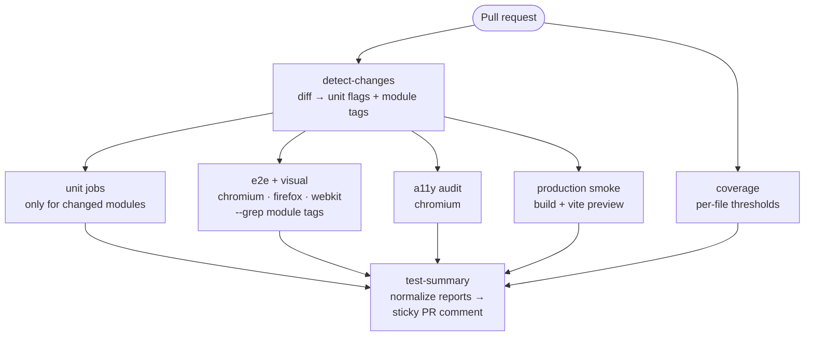
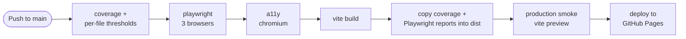

# Trazire Mart

A small e-commerce demo: home page, six products, a cart drawer, and a checkout with validation. No backend, no accounts, no real payments. Data lives in memory and disappears when you reload.

I built it as a target for front-end automation practice and as a place to keep the test setup and CI/CD pipeline I'd want on a real project. The app stays small so the tests and pipeline stay readable.

**Live demo:** [https://playground.trazire.com/](https://playground.trazire.com/)

**Test reports:** [unit coverage](https://playground.trazire.com/coverage/) · [Playwright report](https://playground.trazire.com/test-reports/)

## What's in it

- Home, shop, cart drawer, and a checkout split into address, payment, review, and confirmation
- A `data-testid` on every element a test needs to click or assert
- Business logic as plain functions with no DOM access
- No CDNs or third-party requests. Product images, favicon, and the OG image are all local
- Simulated payments: card formatting, brand detection, a `TEST MODE` label, and copy that says nothing is charged

Routes are hash-based: `#/`, `#/shop`, `#/checkout/address`, `#/checkout/payment`, `#/checkout/review`, `#/confirmation`. The cart is a drawer that works from any screen. Only the checkout flow is step-routed, and each step has a guard, so you can't deep-link past one.

## Practising against it

The app is a target for front-end automation practice:

- stable selectors on a real DOM
- flows that justify page objects
- validation errors and route guards as negative cases
- pages for axe audits and screenshot comparison
- a pipeline you can read or copy

## App structure

| Piece | What it is | Notes |
|-------|------------|-------|
| `src/products.js`, `src/cart.js`, `src/checkout.js`, `src/payment.js`, `src/checkout-state.js` | Plain functions | No DOM, so unit tests run in milliseconds |
| `src/views/**` | Render functions that take an `app` element | No listeners; events are handled elsewhere |
| `src/router.js` | Hash router | Fits GitHub Pages without server rewrites; Back button works |
| `src/main.js` | DOM wiring, delegated events, route guards | The only file that touches the document |
| `src/effects.js` | Fly-to-cart, badge pop, toast | Skips animation when `prefers-reduced-motion` is set |
| `index.html` | Shell: banner, header, cart drawer, toast | Views mount into `#app` |

Build: Vite 6. Styling: Tailwind 4, utility classes only. The production build gets a stricter CSP than dev: a small Vite transform removes `'unsafe-inline'` from `style-src`, because only the dev server needs it.

## Tests

| Layer | Tool | What it covers |
|-------|------|----------------|
| Unit | Vitest | Cart math, checkout and payment rules, checkout state, view output, and the CI scripts (tag mapping, report parsing, summary rendering) |
| Component | Playwright `setContent` | Cart item and checkout page markup, without booting the app |
| E2E | Playwright + page objects | Home, shop, cart, routing, checkout flow, guards, validation errors, on Chromium, Firefox, and WebKit |
| Accessibility | `@axe-core/playwright` | 7 pages: home, shop, cart, address, payment, review, confirmation |
| Visual | Playwright screenshots | 7 screens × 3 browsers. Baselines are committed and generated on Linux |
| Smoke | Playwright against `vite preview` | The built artifact: assets load, no console errors or failed requests, add-to-cart works |

How it's split:

- Pure modules get unit tests. Views are pure render functions, so they get unit tests too, using a stub object instead of a browser.
- `main.js`, `router.js`, and `effects.js` are left out of unit coverage. They're DOM and event code, and Playwright covers them.
- Coverage thresholds are per file: 90% statements/functions/lines, 80% branches. A new file with no tests can't hide behind the overall average.
- Every spec is tagged (`@home`, `@shop`, `@cart`, `@checkout`). CI maps changed paths to tags, so a PR that touches the cart runs the cart slice only.
- `scripts/parse-test-report.mjs` and `scripts/ci-summary.mjs` are plain modules with unit tests, so report parsing and summary rendering don't need a workflow run to verify.
- Accessibility runs on Chromium only. Page-level axe results don't differ much between engines, and one browser keeps the job quick.
- Visual baselines run on Linux with the font stack pinned. Without the pin, the same page measures 1017px locally and 977px on the runner, and every screenshot fails.
- The smoke test runs the built output through `vite preview`. If assets or paths break, CD stops before publishing.

Current totals: 147 unit tests, 174 Playwright runs (58 per browser), 7 a11y audits, 1 smoke test.

## CI/CD

**Pull requests.** `detect-changes` reads the diff and decides what runs.

**Push to `main`.** The build job runs everything; the deploy job only publishes.

Pipeline details:

- The deploy job is separate from the build job. Build and test steps run with `contents: read`; only the short deploy job gets `pages: write` and `id-token: write`.
- Deployments are never cancelled. A cancelled Pages deploy can leave a failed deployment record, so CD queues instead; PR checks still cancel superseded runs to save time.
- Reports are copied into the deployed site, so `/coverage/` and `/test-reports/` always match the running build.
- Each test job writes a `test-status-*` artifact through `scripts/parse-test-report.mjs`, including failed jobs. `test-summary` runs with `if: always()`, aggregates them with `scripts/ci-summary.mjs`, and writes the run summary plus a PR comment.
- The comment step deletes the previous bot comment before posting, so there is one status comment per PR. Fork PRs skip it (read-only token); the run summary is still written.
- CD writes run summaries too: build stage outcomes, then the deployed URL or failure from the deploy job.

What a PR runs:

| Changed files | Unit jobs | Browser tests |
|---|---|---|
| `src/cart.js` | `cart-unit` | cart slice only: E2E, component, a11y, visual |
| `src/views/home.js` | none | `@home` |
| `src/products.js` | `products-unit` | `@home` and `@shop`, since both render product data |
| `src/payment.js` | none (coverage still runs every unit test) | `@checkout` |
| `package.json` | all three unit jobs | everything |
| `README.md` | none | E2E, a11y and smoke skipped; coverage still runs |
| `scripts/**`, `.github/**` | none | everything, since these are shared patterns |

Workflows: [ci.yml](.github/workflows/ci.yml) · [cd.yml](.github/workflows/cd.yml) · Development notes: [HOWTO.md](HOWTO.md)

## Decisions and trade-offs

| Decision | Alternative | Why |
|---|---|---|
| Hash routing | History API or a multi-page build | GitHub Pages has no server rewrites. Hash routing gives real URLs and a working Back button with no deploy setup. |
| No framework | React or Vue | Keeps the browser tab and the CI runtime boring, so the test code is what you read. |
| Pure views, events in `main.js` | Listeners inside each view | Views stay testable without a browser, and all the DOM wiring sits in one file. |
| Per-file coverage | One global percentage | Globals let an untested file pass as long as the rest of the code is covered. |
| Module tags for E2E | Run everything, or run changed spec files | Tags follow behavior instead of file paths, and PR runs stay short. |
| a11y on Chromium only | Add it to the 3-browser matrix | Same signal for a third of the time. |
| Smoke test gates the deploy | Trust the dev-server E2E | Only the built artifact catches wrong asset paths before users see them. |
| Font stack pinned to Arial/Helvetica | System font stack | Removes layout drift between local and CI. See the 1017/977 note above. |
| Custom domain at the root | Keep the `/web-playground/` project path | Pages drops the repository path once a custom domain is set; the old `github.io/repo/` URL 301s to the root. Assets and links have to be root-relative. |
| Local SVG product images | Placeholder service or a CDN | No third-party requests at runtime, and CI sees exactly what users see. |
| Payments simulated, clearly labelled | Fake the whole thing quietly | Looks like a checkout, says it isn't one. |
| Dependabot parked at `dependabot.yml.example` | Weekly update PRs | This is a demo. I'd rather bump dependencies when there's a reason. Rename and uncomment to turn it on. |
| Deploys never cancel | `cancel-in-progress: true` everywhere | A cancelled Pages deploy can leave a failed deployment. PR checks still cancel. |

## Known limits

- Expiry validation checks the format and that the month is 01–12. It doesn't check that the date is in the future, and there's no Luhn check. Fine for a demo, not for a store.
- Component specs render committed markup fragments, so they can drift from the views. The unit view tests are the real check.
- axe runs the WCAG A/AA rules only, not the best-practice set.
- The next step I'd take is moving E2E and visual tests into their own repository and triggering them from this one with a reusable workflow, which is closer to how my last team split app and test repos.

## How this repo was built

The application code was built with AI assistance. I designed and implemented the test strategy, automation architecture, and CI/CD pipeline; that is what this repo demonstrates.

## Author

**Rio Anggara Pratama** — Senior SDET with 10+ years in software engineering: test infrastructure, automation frameworks, and CI/CD.

- LinkedIn: [linkedin.com/in/rio-anggara](https://www.linkedin.com/in/rio-anggara/)
- GitHub: [@rio-ap](https://github.com/rio-ap)
- Portfolio: [me.trazire.com](https://me.trazire.com/)

## License

MIT — see [LICENSE](LICENSE).
