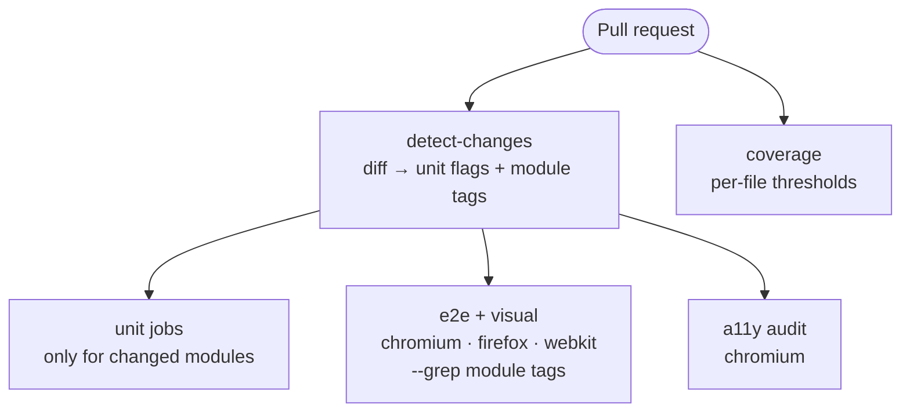
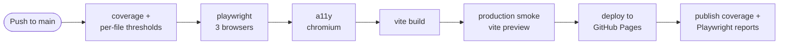

# Trazire Mart — a front-end test automation playground

A small, self-contained e-commerce SPA (home landing, product catalog, cart drawer, routed multi-step checkout) built to be a stable target for practising front-end test automation — and a reference implementation for test architecture and CI/CD design.

**Live demo:** [https://playground.trazire.com/web-playground/](https://playground.trazire.com/web-playground/)

**Test reports:** [unit coverage](https://playground.trazire.com/web-playground/coverage/) · [Playwright report](https://playground.trazire.com/web-playground/test-reports/)

## What this is

The app does four things: lands on a welcome home page, lists six products in a shop catalog, manages a cart drawer, and runs a routed, validated checkout (address → payment → review → confirmation). Payments are simulated in-browser — card fields are validated and formatted by pure helpers, but nothing leaves the page. Everything beyond that exists to make automation honest and repeatable:

- hash-based routing (`#/`, `#/shop`, `#/checkout/...`) with guard redirects, so deep links and back/forward behave predictably
- every interactive element carries a `data-testid` — no brittle CSS or text selectors needed
- business logic is pure and separated from the DOM, so it is unit-testable without a browser
- no backend, no auth, no real payments, no third-party runtime dependencies
- deterministic state and UI — safe for visual regression and CI

It is deliberately small. The point is the engineering around it, not the app.

## Who it's for

QA and SDET practitioners who want something more realistic than a todo list to practise against:

- locator and waiting strategies against a real DOM
- Page Object Model and test layering
- component-level rendering checks
- accessibility auditing with axe
- visual regression across browsers
- reading (or building) a CI/CD pipeline that actually gates a deploy

## Application design

| Piece | Choice | Why |
|-------|--------|-----|
| App | Vanilla JS ES modules | No framework noise between the test and the browser |
| Logic | `src/products.js`, `src/cart.js`, `src/checkout.js`, `src/payment.js`, `src/checkout-state.js` | Pure functions — unit tests need no DOM |
| Views | `src/views/` (home, shop, checkout steps, confirmation) | Render functions unit-tested in Vitest and mounted by the router |
| Wiring | `src/main.js`, `src/router.js` | App shell and hash router; the only modules bound to DOM events and app state |
| Build | Vite 6 | Fast dev server; production bundle served from the repo's Pages sub-path |
| Styling | Tailwind CSS 4 (`@tailwindcss/vite`) | Utility classes only; no runtime CSS |
| Assets | Local SVG placeholders, local favicon, generated OG image | No CDN or third-party requests — CI and users see identical pages |

Additional details: a strict CSP meta policy, social/OG metadata, an add-to-cart feedback animation that respects `prefers-reduced-motion`, and the sans font stack pinned to `Arial, Helvetica, sans-serif` so Linux CI and local runs render identically.

## Test architecture

Each layer exists because it catches something the others cannot:

| Layer | Tool | Scope |
|-------|------|-------|
| Unit | Vitest | Cart math, checkout validation, payment/card helpers (`src/payment.js`), checkout drafts (`src/checkout-state.js`), product helpers, and view rendering. Coverage applies to pure modules and views; only `src/main.js`, `src/router.js` and `src/effects.js` are excluded as DOM/event-bound. Per-file thresholds: 90% statements/functions/lines, 80% branches |
| Component | Playwright (`setContent`) | Self-contained markup fragments without the full app (cart item, checkout pages) |
| E2E — home & shop | Playwright + Page Object Model | Landing page and catalog (`@home`, `@shop`) on Chromium, Firefox and WebKit |
| E2E — cart & checkout | Playwright + Page Object Model | Cart drawer and routed checkout pages — address, payment, review, confirmation — plus route guards (`@cart`, `@checkout`) on all three browsers |
| Accessibility | `@axe-core/playwright` (own config, chromium) | 7 audits: home, shop, cart drawer, and the four checkout pages — no critical or serious violations; runs as its own CI job |
| Visual regression | Playwright screenshots | 7 screens × 3 browsers, baselines committed and generated on Linux |
| Production smoke | Playwright against `vite preview` | Built output sanity: base path resolves, no console errors or failed requests, images decode, add-to-cart works |

Design decisions worth noting:

- every spec is tagged by module (`@home`, `@shop`, `@cart`, `@checkout`) — that's what lets CI run a targeted slice for a PR instead of the whole suite
- the smoke layer runs against the **built artefact**, not the dev server, so base-path and asset problems fail the pipeline before anything ships
- visual baselines are font-sensitive, so the font stack is pinned rather than left to the system — otherwise the same page is 1017px tall locally and 977px on the runner
- 110 unit tests (including the CI path-to-tag mapping), 162 Playwright runs across three browsers (54 each), plus 7 chromium a11y audits and 1 smoke test — fast enough to run on every PR

## CI/CD design

**Pull request checks** — change-aware fan-out: a one-module PR only runs that module's tests.

**Release pipeline** — every stage must pass before the next one; the deploy happens last.

**CI (pull requests).** A `detect-changes` action inspects the diff and drives job fan-out: a changed module only runs its own unit job, and the 3-browser Playwright matrix only runs when UI or E2E files change. E2E selection is tag-based — changed paths are mapped to module tags (`@home`, `@shop`, `@cart`, `@checkout`), so a cart-only PR runs just the cart-tagged E2E and visual tests plus the cart a11y audit in its own chromium job, while shared or config changes run everything. Coverage thresholds are enforced on every PR, and per-browser Playwright reports, the a11y report and coverage HTML are uploaded as artifacts. Concurrency groups cancel superseded runs. These jobs are wired as required status checks, so a red run blocks the merge.

**CD (push to `main`).** The pipeline re-runs unit coverage, the full 3-browser E2E suite, the accessibility audits, and the Vite build. Only then does the production smoke test run against the built output — the deploy step cannot execute if it fails. Coverage and Playwright reports are copied into the deployed site, so every release publishes its own test evidence at `/coverage/` and `/test-reports/`.

Workflows: [`.github/workflows/ci.yml`](.github/workflows/ci.yml) · [`.github/workflows/cd.yml`](.github/workflows/cd.yml)

## How this repo was built

The application code was built with AI assistance. The test strategy, automation architecture, and CI/CD pipeline were designed and implemented by me — that's the part this repo is meant to demonstrate.

## Author

**Rio Anggara Pratama** — Senior SDET, 10+ years in QA engineering.

- LinkedIn: [linkedin.com/in/rio-anggara](https://www.linkedin.com/in/rio-anggara/)
- GitHub: [@rio-ap](https://github.com/rio-ap)

## License

MIT — see [LICENSE](LICENSE).
